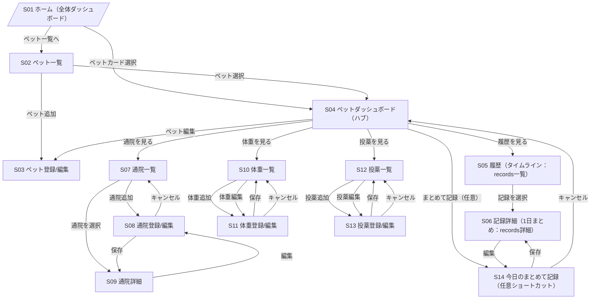

# 02_画面遷移図（改訂版：領域別ページ設計）

## 1. 目的
本ドキュメントは、ペットカルテアプリ（MVP）における画面遷移を可視化し、  
ユーザーが「どこから何ができるか」を迷わない導線として固定することを目的とする。

---

## 2. 改訂の背景（要点）
- ホーム（S01）を **全体ダッシュボード** とし、ペットごとの状況を俯瞰して領域別へ誘導する
- ペット単位の **ダッシュボード（S04）** をハブとして、通院/体重/投薬/履歴へ分岐させる
- 通院/体重/投薬は **一覧 → 登録/編集 → 詳細（通院）** の領域別フローを持つ
- 従来の「まとめて記録（S14）」は **任意のショートカット** として残す

---

## 3. 画面遷移（全体）

---

## 4. 主要導線（MVPで最優先）

### 4.1 通院（主役）
- S01 → S04 → S07 → S08 → S09  
  - 迷いポイントを減らすため、S04に「通院追加」ボタンも置く（S08へ直通でも良い）

### 4.2 体重（サクッと入力）
- S01 → S04 → S10 → S11 → S10

### 4.3 投薬（継続/履歴）
- S01 → S04 → S12 → S13 → S12

### 4.4 まとめて振り返り（横断）
- S01 → S04 → S05 → S06

### 4.5 まとめて記録（任意ショートカット）
- S01 → S04 → S14 → S06

---

## 5. 実装メモ（迷いを減らすためのルール）

- S04（ハブ）には必ず「通院/体重/投薬/履歴」へのボタンを持たせる
- 通院は「一覧→詳細→編集」が自然。体重/投薬は詳細ページを作らず「一覧→編集」でMVP可
- S14（まとめて記録）はMVPの必須導線から外しても成立する（ただし既存設計互換のため残す）

