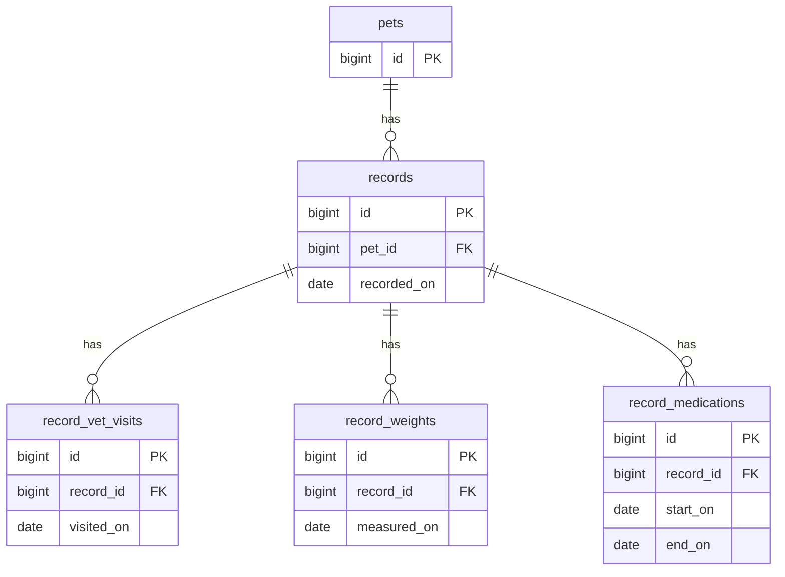

# 06_データモデル（改訂版：領域別ページ設計 v2）

## 1. 目的
本ドキュメントは、ペットカルテアプリ（MVP）のデータモデル（テーブル/カラム/リレーション/制約/インデックス）を定義し、
画面（v2）およびAPI（v2）と整合する永続化構造を固定する。

---

## 2. v2での変更点（重要）
### 2.1 通院を主役にするための変更
- **record_vet_visits に `visited_on`（受診日）を追加**  
  - 後追い入力（記録日≠受診日）に強くなる
  - 通院一覧（S07）で「通院の日付」を安定して扱える

### 2.2 領域別ページとの整合
- 体重：`measured_on`
- 投薬：`start_on` / `end_on`
- まとめ（records）は「日付で振り返る横断用途」として残す

### 2.3 削除方針（推奨）
- MVPでは削除は **論理削除** を推奨（誤操作対策）  
  - 各テーブルに `is_deleted`, `deleted_at` を持たせる方針を提示（実装で統一）

---

## 3. 命名規約（DB）
- テーブル名：snake_case / 複数形 or 既存に合わせる（本書は既存の `record_*` を踏襲）
- 主キー：`id`（BIGINT推奨）
- 外部キー：`{entity}_id`
- 日付：`*_on`（DATE）
- 日時：`created_at`, `updated_at`, `deleted_at`（DATETIME）

---

## 4. ER（概略）

※領域別API（/vet-visits, /weights, /medications）でも、DB上は `records` に紐づけて管理する。  
（実装では「領域別登録時に records を自動作成して紐づける」運用でOK）

---

## 5. テーブル定義

> 型は MySQL 8 を想定。`utf8mb4` を前提。

### 5.1 pets（ペット）
| カラム | 型 | Null | Key | デフォルト | 説明 |
|---|---|---:|---|---|---|
| id | BIGINT | NO | PK | - | ペットID |
| name | VARCHAR(100) | NO |  | - | ペット名 |
| species | VARCHAR(50) | YES |  | NULL | 種別（cat/dog等） |
| sex | VARCHAR(20) | YES |  | NULL | 性別（male/female/unknown） |
| birth_date | DATE | YES |  | NULL | 誕生日 |
| photo_url | VARCHAR(500) | YES |  | NULL | 画像URL（MVPは任意） |
| created_at | DATETIME | NO |  | CURRENT_TIMESTAMP | 作成日時 |
| updated_at | DATETIME | NO |  | CURRENT_TIMESTAMP | 更新日時 |
| is_deleted | TINYINT(1) | NO |  | 0 | 論理削除 |
| deleted_at | DATETIME | YES |  | NULL | 削除日時 |

**Indexes**
- `idx_pets_is_deleted`（is_deleted）

---

### 5.2 records（1日まとめ：親）
| カラム | 型 | Null | Key | デフォルト | 説明 |
|---|---|---:|---|---|---|
| id | BIGINT | NO | PK | - | レコードID |
| pet_id | BIGINT | NO | FK | - | pets.id |
| recorded_on | DATE | NO |  | - | 記録日（履歴の軸） |
| condition | VARCHAR(20) | YES |  | NULL | 体調（例: good/normal/bad） |
| note | TEXT | YES |  | NULL | メモ |
| created_at | DATETIME | NO |  | CURRENT_TIMESTAMP | 作成日時 |
| updated_at | DATETIME | NO |  | CURRENT_TIMESTAMP | 更新日時 |
| is_deleted | TINYINT(1) | NO |  | 0 | 論理削除 |
| deleted_at | DATETIME | YES |  | NULL | 削除日時 |

**Constraints**
- FK: `records.pet_id -> pets.id`
- **Unique（推奨）**: `uq_records_pet_date (pet_id, recorded_on)`  
  - 1ペット1日1レコードにする場合（S05/S14が扱いやすい）  
  - もし「同日に複数の記録」を許可したい場合は外す

**Indexes**
- `idx_records_pet_date (pet_id, recorded_on)`
- `idx_records_is_deleted (is_deleted)`

---

### 5.3 record_vet_visits（通院）
| カラム | 型 | Null | Key | デフォルト | 説明 |
|---|---|---:|---|---|---|
| id | BIGINT | NO | PK | - | 通院ID |
| record_id | BIGINT | NO | FK | - | records.id |
| visited_on | DATE | NO |  | - | **受診日（v2追加）** |
| hospital_name | VARCHAR(200) | YES |  | NULL | 病院名 |
| doctor_name | VARCHAR(200) | YES |  | NULL | 医師名 |
| chief_complaint | VARCHAR(500) | YES |  | NULL | 主訴 |
| diagnosis | VARCHAR(500) | YES |  | NULL | 診断 |
| cost_yen | INT | YES |  | NULL | 費用（円） |
| note | TEXT | YES |  | NULL | メモ |
| created_at | DATETIME | NO |  | CURRENT_TIMESTAMP | 作成日時 |
| updated_at | DATETIME | NO |  | CURRENT_TIMESTAMP | 更新日時 |
| is_deleted | TINYINT(1) | NO |  | 0 | 論理削除 |
| deleted_at | DATETIME | YES |  | NULL | 削除日時 |

**Constraints**
- FK: `record_vet_visits.record_id -> records.id`
- Check（アプリ側）: `cost_yen >= 0`

**Indexes**
- `idx_vet_visits_record (record_id)`
- `idx_vet_visits_visited_on (visited_on)`
- `idx_vet_visits_deleted (is_deleted)`

**メモ**
- 領域別APIで `pet_id` を受け取るが、DB上は `records` 経由でペットに紐づく。
- 実装では `visited_on` を基準に、同日の `records` を作成/取得して `record_id` を設定する。

---

### 5.4 record_weights（体重）
| カラム | 型 | Null | Key | デフォルト | 説明 |
|---|---|---:|---|---|---|
| id | BIGINT | NO | PK | - | 体重ID |
| record_id | BIGINT | NO | FK | - | records.id |
| measured_on | DATE | NO |  | - | 計測日 |
| weight_kg | DECIMAL(5,2) | NO |  | - | 体重(kg) |
| note | VARCHAR(500) | YES |  | NULL | メモ |
| created_at | DATETIME | NO |  | CURRENT_TIMESTAMP | 作成日時 |
| updated_at | DATETIME | NO |  | CURRENT_TIMESTAMP | 更新日時 |
| is_deleted | TINYINT(1) | NO |  | 0 | 論理削除 |
| deleted_at | DATETIME | YES |  | NULL | 削除日時 |

**Constraints**
- FK: `record_weights.record_id -> records.id`
- Check（アプリ側）: `weight_kg > 0`

**Indexes**
- `idx_weights_record (record_id)`
- `idx_weights_measured_on (measured_on)`
- `idx_weights_deleted (is_deleted)`

---

### 5.5 record_medications（投薬）
| カラム | 型 | Null | Key | デフォルト | 説明 |
|---|---|---:|---|---|---|
| id | BIGINT | NO | PK | - | 投薬ID |
| record_id | BIGINT | NO | FK | - | records.id |
| name | VARCHAR(200) | NO |  | - | 薬名 |
| dosage | VARCHAR(200) | YES |  | NULL | 用量（例: 1/2錠） |
| frequency | VARCHAR(200) | YES |  | NULL | 頻度（例: 1日2回） |
| start_on | DATE | NO |  | - | 開始日 |
| end_on | DATE | YES |  | NULL | 終了日（NULL=継続中） |
| note | TEXT | YES |  | NULL | メモ |
| created_at | DATETIME | NO |  | CURRENT_TIMESTAMP | 作成日時 |
| updated_at | DATETIME | NO |  | CURRENT_TIMESTAMP | 更新日時 |
| is_deleted | TINYINT(1) | NO |  | 0 | 論理削除 |
| deleted_at | DATETIME | YES |  | NULL | 削除日時 |

**Constraints**
- FK: `record_medications.record_id -> records.id`
- Check（アプリ側）: `end_on >= start_on`（end_onがある場合）

**Indexes**
- `idx_medications_record (record_id)`
- `idx_medications_period (start_on, end_on)`
- `idx_medications_deleted (is_deleted)`

---

## 6. クエリ観点（画面/ API との対応）
### 6.1 ホーム/ペットダッシュボードのサマリ（S01/S04）
- 直近通院：`record_vet_visits` を `visited_on DESC` で1件
- 直近体重：`record_weights` を `measured_on DESC` で1件
- 継続投薬：`record_medications` で `end_on IS NULL OR end_on >= CURDATE()`

※ pet_id 条件は records 経由で絞り込み
- `records.pet_id = :pet_id AND records.is_deleted=0`

### 6.2 通院一覧（S07）
- `visited_on` でソート、期間検索（from/to）もここで

### 6.3 履歴（S05）
- `records` を `recorded_on DESC` で取得し、子要素の有無（件数）をまとめて返す

---

## 7. visited_on を導入しない場合（代替案）
- `record_vet_visits` に日付が無い場合、通院一覧の受診日は `records.recorded_on` を表示する
- ただし後追い入力の自由度が下がるため、v2では `visited_on` を推奨する

---

## 8. 将来拡張（今は不要）
- 添付（領収書/検査結果）：`record_attachments`（visit/recordに紐付け）
- 病院マスタ：`hospitals`（候補入力の精度向上）
- 再診管理：`next_visit_on`（vet_visitsに追加）
- 複数ユーザー：`users` + `pets.user_id`

