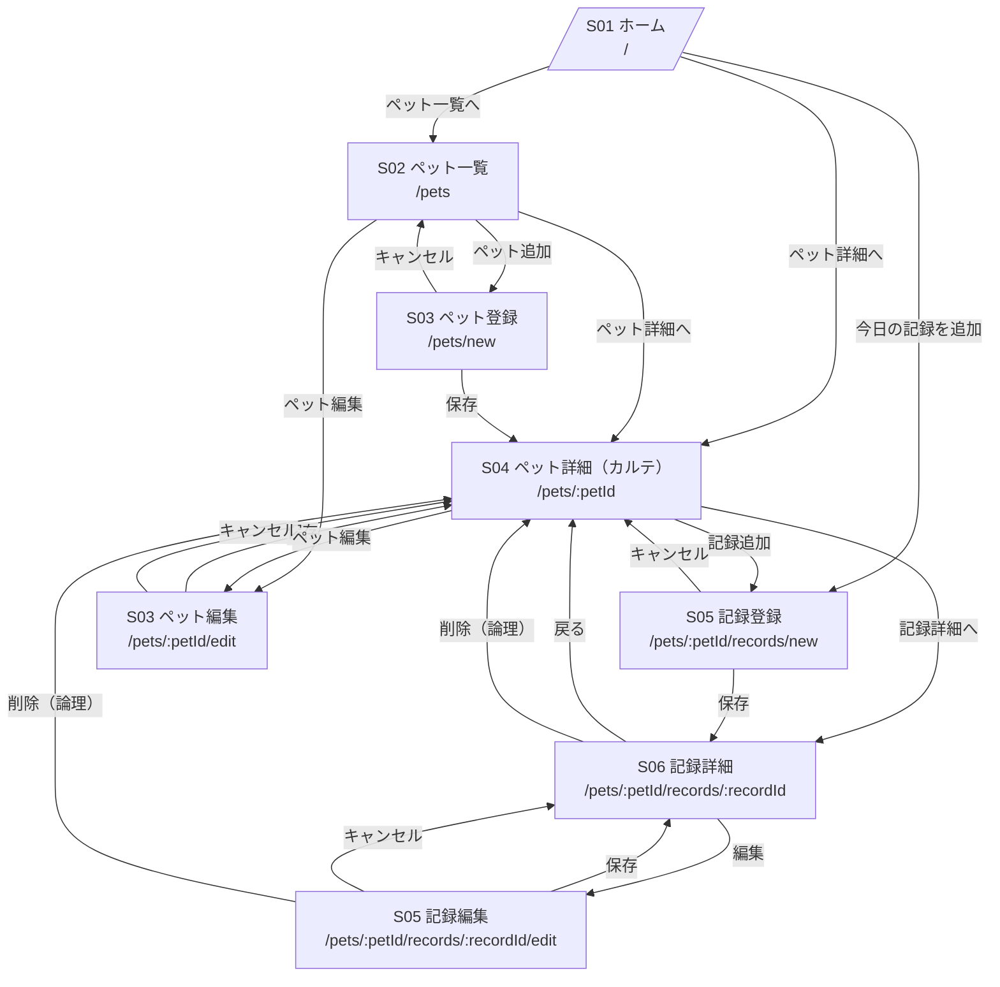

# 02_画面遷移図

## 1. 目的
ペットカルテアプリ（MVP）の画面間遷移を明確化し、実装時の導線ブレ・画面抜け漏れを防ぐ。

---

## 2. 前提（MVP）
- 認証なし（シングルユーザー想定）
- 追加/編集は同一UIを基本（URLはnew/editで分岐しても内部は共通）
- 削除は論理削除を基本（復元はMVP外）

---

## 3. 画面遷移図（全体）

## 4. 主要導線（MVPで最優先）

### 4.1 記録導線（最重要）
- **S01（ホーム）→ S05（記録登録）** を最短導線にする
- 「今日の記録」を迷わず開始できることを最優先とする
- 保存後は **S06（記録詳細）** に遷移し、内容確認と再編集を容易にする

### 4.2 振り返り導線
- S01（直近記録）→ S06（記録詳細）
- S04（ペット詳細・時系列）→ S06（記録詳細）
- 時系列閲覧を起点に、過去記録へ自然に遷移できる構成とする

### 4.3 管理導線（ペット情報）
- ペット追加：S02（ペット一覧）→ S03（登録）
- ペット編集：S02 / S04 → S03（編集）
- 保存後は必ず S04（ペット詳細）へ戻る

---

## 5. 画面別遷移整理

### S01 ホーム
- 遷移先：S02 / S04 / S05（新規）

### S02 ペット一覧
- 遷移先：S04 / S03（新規・編集）

### S03 ペット登録/編集
- 保存後：S04
- キャンセル：遷移元へ戻る

### S04 ペット詳細（カルテ）
- 遷移先：S05（新規） / S06 / S03（編集）

### S05 記録登録/編集
- 保存後：S06
- キャンセル：新規＝S04、編集＝S06
- 削除（編集時）：S04

### S06 記録詳細
- 遷移先：S05（編集）
- 戻る：S04
- 削除：S04

---

## 6. 設計メモ

- `new / edit` はURLで分けるが、Reactコンポーネントは共通化する
- 画面IDはログ出力・将来の権限管理拡張で利用可能
- MVPでは「記録導線」を最優先し、設定系は奥に配置する
