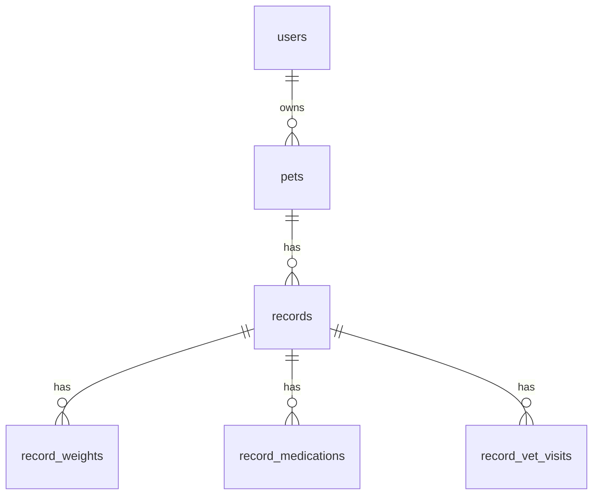

# 06_データモデル

## 1. 目的

本ドキュメントは「ペットカルテアプリ（MVP）」における  
**データ構造の全体像を明確化し、実装時の迷いを無くすこと**を目的とする。

- 時系列でペットの健康情報を管理できること
- 記録漏れを防ぎ、継続しやすい構造であること
- 将来的な機能拡張に耐えられること

を前提に設計する。

---

## 2. 設計方針

- **1日の記録を1つの親レコードとして扱う**
- 詳細情報は用途別に子テーブルへ分離する
- CRUDの単純さより「記録のしやすさ・振り返りやすさ」を優先
- 論理削除を基本とする
- MySQL（InnoDB）前提

---

## 3. エンティティ一覧（MVP）

|エンティティ名|概要|
|---|---|
|users|飼い主（MVPでは実質1ユーザー）|
|pets|ペットの基本情報|
|records|日付単位の健康記録（親）|
|record_weights|体重記録|
|record_medications|投薬記録|
|record_vet_visits|通院記録|

---

## 4. リレーション概要

- users 1 - N pets
- pets 1 - N records
- records 1 - N record_weights
- records 1 - N record_medications
- records 1 - N record_vet_visits

---

## 5. テーブル定義

### 5.1 users

|論理名|物理名|型|最大桁数|必須|備考|
|---|---|---|---|---|---|
|ID|id|BIGINT|19|○||
|ユーザー名|name|VARCHAR(100)|100|||
|作成日時|created_at|DATETIME|-|○||
|更新日時|updated_at|DATETIME|-|○||

---

### 5.2 pets

|論理名|物理名|型|最大桁数|必須|備考|
|---|---|---|---|---|---|
|ID|id|BIGINT|19|○||
|ユーザーID|user_id|BIGINT|19|○|users.id|
|ペット名|name|VARCHAR(50)|50|○||
|種別|species|ENUM('dog','cat','other')|-|○||
|品種|breed|VARCHAR(50)|50|||
|性別|sex|ENUM('male','female','unknown')|-|||
|誕生日|birthday|DATE|-|||
|メモ|notes|TEXT|-|||
|削除フラグ|is_deleted|TINYINT(1)|1|○|論理削除|
|作成日時|created_at|DATETIME|-|○||
|更新日時|updated_at|DATETIME|-|○||

**Index**
- (user_id, is_deleted)
- (user_id, name)

---

### 5.3 records（親レコード）

|論理名|物理名|型|最大桁数|必須|備考|
|---|---|---|---|---|---|
|ID|id|BIGINT|19|○||
|ペットID|pet_id|BIGINT|19|○|pets.id|
|記録日|recorded_on|DATE|-|○|記録日|
|タイトル|title|VARCHAR(100)|100|||
|体調レベル|condition_level|TINYINT|1||1〜5|
|食欲レベル|appetite_level|TINYINT|1||1〜5|
|便の状態|stool_level|TINYINT|1||1〜5|
|メモ|memo|TEXT|-|||
|削除フラグ|is_deleted|TINYINT(1)|1|○|論理削除|
|作成日時|created_at|DATETIME|-|○||
|更新日時|updated_at|DATETIME|-|○||

**Index**
- (pet_id, recorded_on)
- (pet_id, is_deleted, recorded_on)

---

### 5.4 record_weights

|論理名|物理名|型|最大桁数|必須|備考|
|---|---|---|---|---|---|
|ID|id|BIGINT|19|○||
|記録ID|record_id|BIGINT|19|○|records.id|
|体重(kg)|weight_kg|DECIMAL(5,2)|5,2|○||
|測定日時|measured_at|DATETIME|-|||
|メモ|note|VARCHAR(200)|200|||
|作成日時|created_at|DATETIME|-|○||
|更新日時|updated_at|DATETIME|-|○||

---

### 5.5 record_medications

|論理名|物理名|型|最大桁数|必須|備考|
|---|---|---|---|---|---|
|ID|id|BIGINT|19|○||
|記録ID|record_id|BIGINT|19|○|records.id|
|薬名|name|VARCHAR(100)|100|○|薬名|
|用量|dosage|VARCHAR(100)|100|||
|頻度|frequency|VARCHAR(100)|100|||
|開始日|started_on|DATE|-|||
|終了日|ended_on|DATE|-|||
|メモ|note|VARCHAR(200)|200|||
|作成日時|created_at|DATETIME|-|○||
|更新日時|updated_at|DATETIME|-|○||

---

### 5.6 record_vet_visits

|論理名|物理名|型|最大桁数|必須|備考|
|---|---|---|---|---|---|
|ID|id|BIGINT|19|○||
|記録ID|record_id|BIGINT|19|○|records.id|
|病院名|hospital_name|VARCHAR(100)|100|||
|獣医師名|doctor|VARCHAR(50)|50|||
|受診理由|reason|VARCHAR(200)|200|||
|診断結果|diagnosis|VARCHAR(200)|200|||
|費用(円)|cost_yen|INT|10|||
|メモ|note|TEXT|-|||
|作成日時|created_at|DATETIME|-|○||
|更新日時|updated_at|DATETIME|-|○||

---

## 6. ER図

